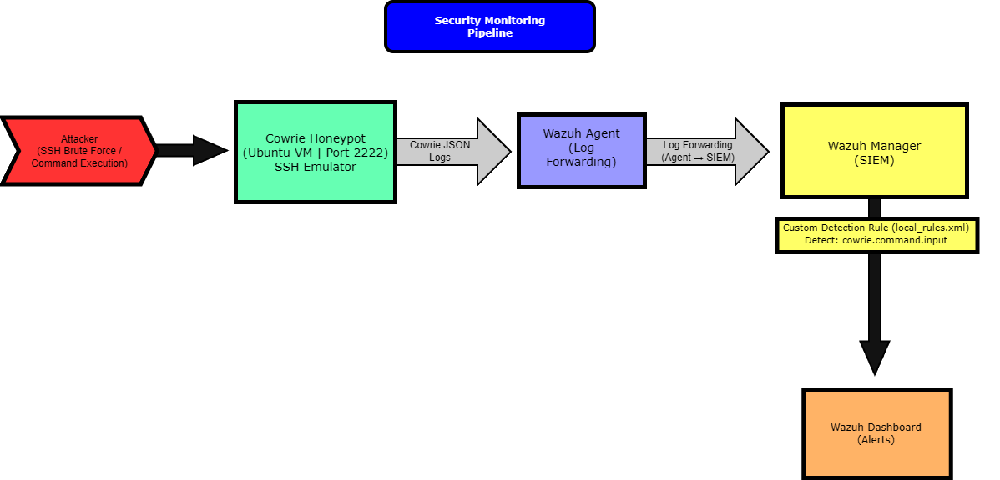

# Security Monitoring & Detection Lab (Wazuh + Cowrie Honeypot)

## Overview
Designed and implemented a security monitoring environment to simulate attacker activity and analyze how events are captured, ingested, and detected within a SIEM.

The environment integrates a Cowrie SSH honeypot with a Wazuh SIEM to replicate a simplified SOC workflow, enabling the generation, processing, and detection of security events based on real attacker behavior.

---

## Lab Architecture

---

## Technologies Used
- Wazuh (SIEM / log analysis)
- Cowrie (SSH honeypot)
- Oracle VirtualBox
- Ubuntu Linux

---

## Key Responsibilities

- Deployed and configured a Wazuh SIEM for centralized log ingestion and analysis  
- Implemented a Cowrie SSH honeypot to simulate attacker interactions  
- Designed a log ingestion pipeline using Wazuh agents and JSON-based log parsing  
- Simulated attacker activity through SSH connections and command execution  
- Ingested and analyzed structured logs generated by the honeypot  
- Developed custom detection rules to identify command execution events  
- Validated detection logic using both simulated attacks and Wazuh log testing tools  
- Investigated generated alerts within the SIEM dashboard  

---

## Detection Pipeline

- Attacker initiates SSH connection to honeypot (port 2222)  
- Cowrie captures session activity and logs events in JSON format  
- Wazuh agent forwards logs to the SIEM  
- Wazuh parses and processes incoming events  
- Custom detection rules evaluate event data  
- Alerts are generated and visualized in the dashboard  

---

## Detection Engineering

Developed a custom Wazuh rule to detect command execution within the honeypot environment:

    <rule id="100201" level="5">
      <decoded_as>json</decoded_as>
      <field name="eventid">^cowrie\.command\.input$</field>
      <description>Cowrie command executed: $(input)</description>
    </rule>

---

## Validation & Testing

### Attack Simulation
Simulated attacker activity by connecting to the honeypot via SSH and executing commands.

---

### Log Ingestion Verification
Confirmed that Cowrie logs were successfully ingested and parsed by Wazuh.

---

### Alert Generation
Validated that custom detection rules triggered alerts based on attacker commands.

---

## Results

- Simulated SSH-based attacker behavior and command execution  
- Captured and structured logs using a honeypot environment  
- Centralized log ingestion into a SIEM platform  
- Developed and validated custom detection rules  
- Successfully generated alerts based on attacker activity  

---

## Skills Demonstrated

- SIEM Monitoring (Wazuh)  
- Log Ingestion & Analysis  
- Detection Engineering  
- Security Event Investigation  
- Linux System Administration  
- Honeypot Deployment  
- Troubleshooting & Debugging  

---

## Summary

This project demonstrates practical experience in building and operating a security monitoring pipeline, from attack simulation to detection and alerting.

The implementation reflects core SOC workflows, including log ingestion, event analysis, detection rule development, and alert validation, providing hands-on experience relevant to entry-level security operations roles.
